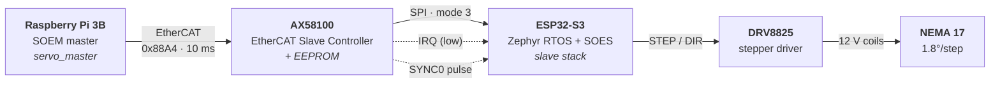
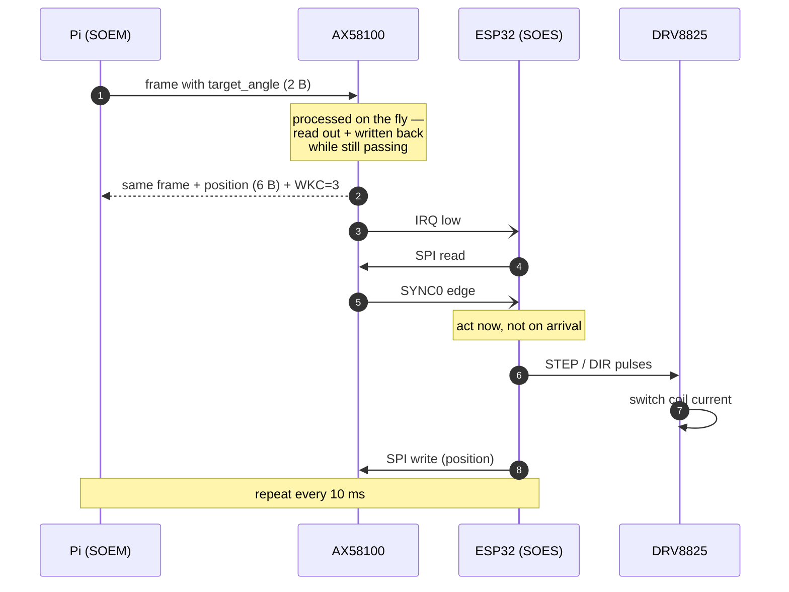
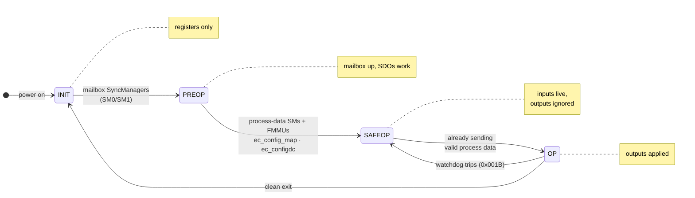
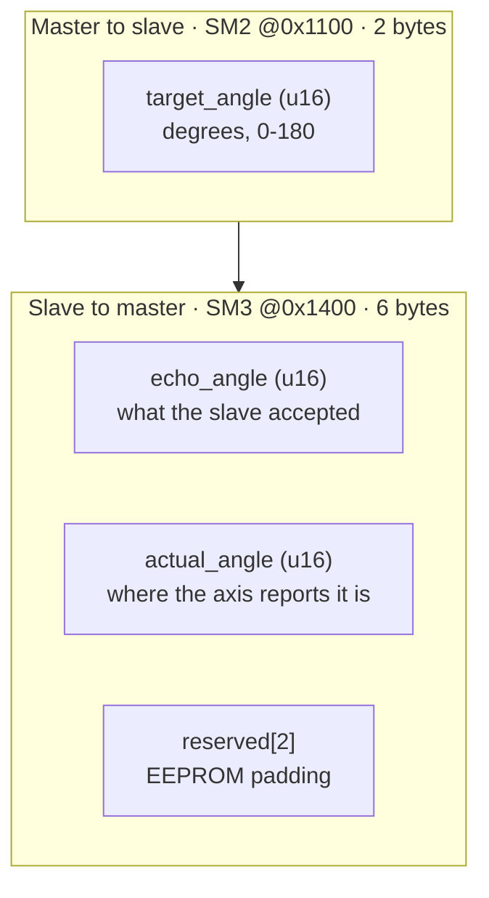

# EtherCAT Servo Node

A number typed on a Raspberry Pi becomes shaft angle on a stepper motor, over a
real industrial fieldbus — one frame every 10 ms, synchronised to a distributed
clock, with every claim below checked by a script that runs against the hardware.

Both sides of the bus are written here: the master application on the Pi, and
the slave firmware on an ESP32-S3. Nothing between them is simulated.

<!-- ─────────────────────────────────────────────────────────────────────────
     WALKTHROUGH VIDEO
     Replace VIDEO_ID with the YouTube id, and thumbnail with your own frame
     if you prefer it to the auto-generated one.
────────────────────────────────────────────────────────────────────────── -->

## Watch the walkthrough Watch the youtube video!!

[](https://youtu.be/7cpjhBwXiCE)

*A full walkthrough of the hardware and both software stacks — the master, the
EtherCAT slave controller, and the slave firmware.*

<br>


## The bench

<p align="center">
  
</p>

<table>
  <tr>
    <td width="50%">
</td>
    <td width="50%"></td>
  </tr>
  <tr>
    <td align="center"><sub>AX58100 — the EtherCAT slave controller</sub></td>
    <td align="center"><sub>DRV8825 driver and the NEMA 17</sub></td>
  </tr>
</table>

<br>

## It running

```
$ sudo servo_master eth0 move 0 180
Distributed clocks: SYNC0 active on slave 1, 10000 us cycle, 0 us shift.
All slaves reached OP. Expected working counter: 3
target=180 echo=180 actual=180  elapsed_ms=290.2 cycles=29 intermediates=28
```

<br>

---

<br>

## The chain



The two dashed lines are the interesting ones. **IRQ** means *something
happened* — the ESP32 goes and fetches. **SYNC0** means *now* — a pulse the
whole bus agrees on, carrying no data at all.

## One cycle, end to end



The frame never stops at the ESC. It streams through at line rate while the
hardware swaps bytes in and out of it — eight FMMUs and eight SyncManagers doing
the work, no CPU involved. That is what makes EtherCAT deterministic, and it is
why the ESP32 only ever sees plain SPI.

## Getting to OP

The master drives the slave's **AL state machine**. Each step up has a price the
master pays *before* asking, and the slave validates it against its EEPROM.



| State | Value | What works |
|---|---|---|
| INIT | `0x01` | Register access only |
| PRE-OP | `0x02` | Mailbox alive — SDO config |
| SAFE-OP | `0x04` | Inputs live, **outputs not applied** |
| OP | `0x08` | Full cyclic exchange — the motor moves |

SAFE-OP is the one worth understanding: the slave reports its position every
cycle but refuses to act on commands, so the mapping can be verified before
anything physically moves.

---

## Process data

Two bytes out, six bytes in — sized to match what the module's stock EEPROM
declares, so the EEPROM is never written.



`echo` proves the command arrived. `actual` comes from the motion controller's
position counter and **lags while moving** — a full 0→180° move passes through 28
distinct intermediate values. An echo would show zero.

Still open loop: the counter reports steps *emitted*, not steps *taken*.

---

## Repository layout

```
master/            SOEM master application (Raspberry Pi)
  src/main.c         CLI + the cyclic loop
  src/ecat.c         everything that touches SOEM
  src/pdo_layout.h   the wire contract — shared with the firmware
  test/              host-side unit tests, no hardware needed

firmware/          Zephyr + SOES slave (ESP32-S3)
  src/ax58100.c      SPI transport to the ESC
  src/esc_irq.c      IRQ to semaphore to thread (SPI is illegal in an ISR)
  src/sync0.c        DC edge capture, semaphore capped at one permit
  src/stepper.c      angle to microsteps to STEP/DIR
  soes/esc_hw.c      the 92-line SOES port: read, write, init, reset
  soes/slave_objectlist.c   CoE object dictionary
  overlays/          nema17.overlay · sg90.overlay — hardware as data

scripts/
  pi-setup.sh        provision the Pi (tools + SOEM)
  deploy.sh          rsync to the Pi and build there
  fw.sh              build / flash / monitor the ESP32
  verify.sh          23 assertions against the live bus
```

## Quick start

```sh
# Provision the Pi (once)
bash scripts/pi-setup.sh

# Build and deploy the master
PI_USER=<user> PI_HOST=<host> scripts/deploy.sh

# Build and flash the slave
./scripts/fw.sh build nema17 && ./scripts/fw.sh flash

# Drive it
sudo servo_master eth0 scan          # what is on the bus
sudo servo_master eth0 regs          # decode the ESC registers
sudo servo_master eth0 move 0 180    # time one move
sudo servo_master eth0 sweep 4       # continuous sweep
```

Full command list: run `servo_master` with no arguments.

Host-side unit tests, no hardware required:

```sh
cc master/src/angle.c master/test/test_angle.c -o test_angle && ./test_angle
```

## Verification

```sh
./scripts/verify.sh
```

23 assertions against the running hardware. The rule the script lives by: **it
must not contain the numbers it is checking.** Steps per revolution, the angle
limit and the step interval are read out of the running slave over CoE, and
every other expectation is derived from those. A literal `200` or `180` in that
script would be a bug — it would let the tests agree with firmware that had
drifted away from its own devicetree.

```
PASS  move passes through intermediate positions     28 seen
PASS  watchdog trips near its programmed time        90.8 ms vs 100 ms
PASS  wkc 3/3 and low_wkc 0 for the whole run        35 samples

23 passed, 0 failed
```

---

## Hardware

| Part | |
|---|---|
| Master | Raspberry Pi 3B, SOEM v1.4.0 |
| ESC | ASIX AX58100 on a breakout, stock Beckhoff SSC EEPROM |
| Slave MCU | ESP32-S3, Zephyr RTOS + SOES |
| Driver | DRV8825, 12 V, current limited to 0.46 A/phase |
| Motor | 17HS4023 NEMA 17 · 1.8°/step · 200 steps/rev |

## Known limitations

- **Open loop.** Position is steps emitted, not steps taken. A skipped step is
  invisible. Closing this needs an encoder — the ESC has an unused input for one.
- **One node.** The bus and master handle multiple slaves; the PDO layout is
  single-axis. A second node is more hardware plus application logic, not a
  protocol change.

